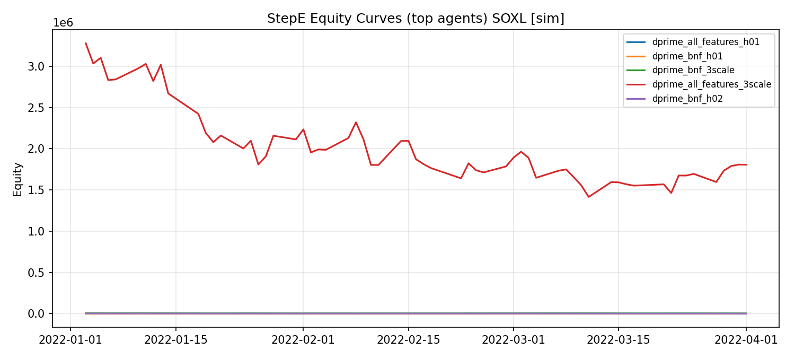

# Run Report

- symbol: **SOXL**
- output_root: `C:/work/apex_work/runs/20260224_151508/output`
- mode(s): `sim`

This report is generated by `tools/generate_run_report.py` and is designed to be readable on GitHub Web.

## Mode: sim

### StepA
- table: [tables/sim_stepA_summary.csv](tables/sim_stepA_summary.csv)
| split | date_start | date_end   | rows | missing_total | close_min         | close_max         | volume_min | volume_max |
| ----- | ---------- | ---------- | ---- | ------------- | ----------------- | ----------------- | ---------- | ---------- |
| train | 2014-01-03 | 2021-12-31 | 2014 | 0             | 1.027999997138977 | 72.98999786376953 | 1351500.0  | 79462500.0 |
| test  | 2022-01-03 | 2022-04-01 | 63   | 0             | 27.90999984741211 | 72.0999984741211  | 15794800.0 | 68456500.0 |
- plot: [plots/sim_stepA_close.png](plots/sim_stepA_close.png)

### StepB
- table: [tables/sim_stepB_metrics.csv](tables/sim_stepB_metrics.csv)
(empty)

### StepDprime
- table: [tables/sim_stepDprime_files.csv](tables/sim_stepDprime_files.csv)
(empty)

### StepE
- table: [tables/sim_stepE_metrics.csv](tables/sim_stepE_metrics.csv)
| agent                      | n_test_rows | total_return_equity  | total_return_prod    | max_drawdown         | sharpe              |
| -------------------------- | ----------- | -------------------- | -------------------- | -------------------- | ------------------- |
| dprime_all_features_h01    | 63          | -0.2212133176683001  | -0.226505617281217   | -0.31708275052785395 | -1.495483350890976  |
| dprime_bnf_h01             | 63          | -0.2285991891268936  | -0.2351426403130633  | -0.3531278578617606  | -1.2491542742871873 |
| dprime_bnf_3scale          | 63          | -0.4178918354891259  | -0.4264566377090593  | -0.43890358295181076 | -1.8218670503837668 |
| dprime_all_features_3scale | 63          | -0.44925381186672875 | -0.45256804993672217 | -0.5683415148167794  | -1.5334433636110214 |
| dprime_bnf_h02             | 63          | -0.5019882716375523  | -0.5086054918658942  | -0.5019882716375523  | -2.5483584269619923 |
| dprime_all_features_h03    | 63          | -0.5558428407551006  | -0.5593680351110389  | -0.5585601777644225  | -2.971449678609056  |
| dprime_bnf_h03             | 63          | -0.5762000400695113  | -0.5825084366493662  | -0.5762000400695113  | -3.0957429691966456 |
| dprime_mix_3scale          | 63          | -0.5970865874939661  | -0.6032614732743646  | -0.5970865874939661  | -2.9412751767542753 |
| dprime_mix_h01             | 63          | -0.5986514365822502  | -0.6045987633721005  | -0.5986514365822502  | -2.9570115452056367 |
| dprime_all_features_h02    | 63          | -0.6033579492580763  | -0.6093577239500279  | -0.6057353914471546  | -3.2495558114014846 |
- plot: [plots/sim_stepE_equity_top.png](plots/sim_stepE_equity_top.png)

### StepF
- table: [tables/sim_stepF_metrics.csv](tables/sim_stepF_metrics.csv)
| source                        | n_test_rows | total_return_equity  | total_return_prod    | max_drawdown         | sharpe              |
| ----------------------------- | ----------- | -------------------- | -------------------- | -------------------- | ------------------- |
| stepF_daily_log_marl_SOXL.csv | 63          | -0.48950627477081543 | -0.49556393809194244 | -0.48950627477081543 | -2.9083836745137996 |
| stepF_equity_marl_SOXL.csv    | 63          | -0.48950627477081543 | -0.49556393809194244 | -0.48950627477081543 | -2.9083836745137996 |
- plot: [plots/sim_stepF_equity_top.png](plots/sim_stepF_equity_top.png)

### Read files
- `C:/work/apex_work/runs/20260224_151508/output/stepA/sim/stepA_periodic_test_SOXL.csv`
- `C:/work/apex_work/runs/20260224_151508/output/stepA/sim/stepA_periodic_train_SOXL.csv`
- `C:/work/apex_work/runs/20260224_151508/output/stepA/sim/stepA_prices_test_SOXL.csv`
- `C:/work/apex_work/runs/20260224_151508/output/stepA/sim/stepA_prices_train_SOXL.csv`
- `C:/work/apex_work/runs/20260224_151508/output/stepA/sim/stepA_split_summary_SOXL.csv`
- `C:/work/apex_work/runs/20260224_151508/output/stepA/sim/stepA_tech_test_SOXL.csv`
- `C:/work/apex_work/runs/20260224_151508/output/stepA/sim/stepA_tech_train_SOXL.csv`
- `C:/work/apex_work/runs/20260224_151508/output/stepB/sim/stepB_pred_time_all_SOXL.csv`
- `C:/work/apex_work/runs/20260224_151508/output/stepE/sim/stepE_daily_log_dprime_all_features_3scale_SOXL.csv`
- `C:/work/apex_work/runs/20260224_151508/output/stepE/sim/stepE_daily_log_dprime_all_features_h01_SOXL.csv`
- `C:/work/apex_work/runs/20260224_151508/output/stepE/sim/stepE_daily_log_dprime_all_features_h02_SOXL.csv`
- `C:/work/apex_work/runs/20260224_151508/output/stepE/sim/stepE_daily_log_dprime_all_features_h03_SOXL.csv`
- `C:/work/apex_work/runs/20260224_151508/output/stepE/sim/stepE_daily_log_dprime_bnf_3scale_SOXL.csv`
- `C:/work/apex_work/runs/20260224_151508/output/stepE/sim/stepE_daily_log_dprime_bnf_h01_SOXL.csv`
- `C:/work/apex_work/runs/20260224_151508/output/stepE/sim/stepE_daily_log_dprime_bnf_h02_SOXL.csv`
- `C:/work/apex_work/runs/20260224_151508/output/stepE/sim/stepE_daily_log_dprime_bnf_h03_SOXL.csv`
- `C:/work/apex_work/runs/20260224_151508/output/stepE/sim/stepE_daily_log_dprime_mix_3scale_SOXL.csv`
- `C:/work/apex_work/runs/20260224_151508/output/stepE/sim/stepE_daily_log_dprime_mix_h01_SOXL.csv`
- `C:/work/apex_work/runs/20260224_151508/output/stepF/sim/stepF_daily_log_marl_SOXL.csv`
- `C:/work/apex_work/runs/20260224_151508/output/stepF/sim/stepF_equity_marl_SOXL.csv`

### Missing / skipped
- StepB: usable true/pred columns not found in C:/work/apex_work/runs/20260224_151508/output/stepB/sim/stepB_pred_time_all_SOXL.csv
- StepDprime: directory missing or empty -> C:/work/apex_work/runs/20260224_151508/output/stepDprime/sim
